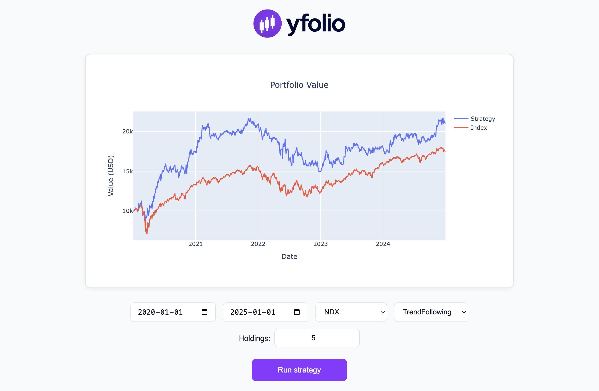

# yfolio 📈

**yfolio** is a lightweight, browser-based backtesting tool that uses historical stock data from Yahoo Finance (`yfinance`). Users can simulate and compare simple portfolio strategies such as trend-following and mean reversion across major stock indices.

---

## 🌐 Features

- Fetches data from Yahoo Finance (via `yfinance`)
- Supports **NDX**, **DAX**, and **OMXS30**
- Implements two strategies:
  - 📈 TrendFollowing
  - 📉 MeanReversion
- Calculates portfolio weights and returns
- Interactive chart built with **Plotly**
- Clean, responsive UI with loading states
- No database required – all in-memory

---

## 🚀 Preview



---

## 📦 Requirements

- Python 3.8+
- pip

---

## 🔧 Installation

1. **Clone the repository:**

   ```bash
   git clone https://github.com/vilhelmhilding/yfolio.git
   cd yfolio
   ```

2. **Install dependencies:**

   It's recommended to use a virtual environment.

   ```bash
   python -m venv venv
   source venv/bin/activate   # On Windows: venv\Scripts\activate
   pip install -r requirements.txt
   ```

3. **Run the app:**

   ```bash
   python app.py
   ```

4. Open your browser and visit:  
   👉 `http://127.0.0.1:5000`

---

## 🧪 Strategy Logic

- Uses **log returns** (`log(1 + r)`) for portfolio performance
- Weekly resampling of indicators to simulate real-world decision intervals
- Portfolio weights are equally distributed among the top/bottom N assets depending on strategy

---

## 📁 Project Structure

```
yfolio/
│
├── static/                    # CSS, logo, favicon, preview
│   ├── style.css
│   ├── favicon.ico
│   ├── logo.png
│   └── preview.png
│
├── templates/                 # HTML templates (Jinja2)
│   └── index.html
│
├── app.py                     # Main Flask application (routes & logic)
├── utils.py                   # Core functions: data loading, strategy logic
├── requirements.txt           # Python dependencies
├── README.md                  # Project description and setup instructions
├── LICENSE                    # MIT License with disclaimer
└── .gitignore                 # Ignored files/folders for Git version control
```

---

## 📌 Notes

- The backtest **does not account** for:
  - Slippage
  - Commissions
  - Dividends
- This is a simplified educational tool, not financial advice.

---

## 🛠 Tech Stack

- Python / Flask
- Pandas / NumPy / yfinance
- Plotly
- HTML / CSS (vanilla)

---

## 📄 License

MIT License. See `LICENSE` file for details.

---

## 🙌 Acknowledgements

- Stock data via [Yahoo Finance](https://finance.yahoo.com/)
- Index tickers parsed from [Wikipedia](https://wikipedia.org/)
